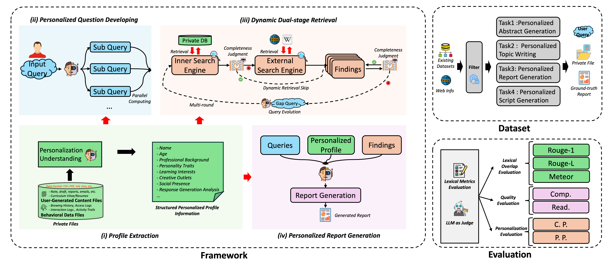

# PDR — Personalized Deep Research

A framework that injects **user-specific context** into every stage of the deep research workflow—**from planning to report generation**—to produce outputs that match a user’s preferred style, structure, and topical focus.

> This repository implements the four core modules proposed in the PDR paper: **Profile Extraction**, **Personalized Question Development**, **Dynamic Dual-Stage Retrieval**, and **Personalized Report Generation**. It also includes the **PDR Dataset** and a **Hybrid evaluation** suite for factuality and personalization.

---

## Table of Contents
- [Key Features](#key-features)
- [Architecture](#architecture)
- [Project Structure](#project-structure)
- [Quickstart](#quickstart)
  - [Installation](#installation)
  - [Usage](#usage)
- [Datasets](#datasets)
- [Evaluation](#evaluation)
- [Citation](#citation)

---

## Key Features
- **Profile Extraction**: Build a structured user profile from heterogeneous sources (notes, drafts, emails, logs) to capture style and preferences.
- **Personalized Question Development**: Decompose a user’s prompt into sub-queries aligned with their profile (intent, tone, granularity).
- **Dynamic Dual-Stage Retrieval**: Seamlessly alternate between **private** (internal) and **public** (external) search; adaptively decide when to stop collecting evidence.
- **Personalized Report Generation**: Synthesize evidence with profile signals to produce **style-consistent**, **factually grounded** reports.
- **Hybrid Evaluation**: Combine lexical metrics (ROUGE-1, ROUGE-L, METEOR) with **LLM-as-judge** scoring for Comprehensiveness, Readability, Content Personalization, and Presentation Personalization.
- **Batteries Included**: Reference configs for vector DB (**Milvus**) and embeddings (**BGE-M3**); scripts to run full pipelines end-to-end.

---

## Architecture



---

## Project Structure

```
.
├─ deepsearcher/             # core library
├─ data/                     # datasets 
│  ├─ abstract/              
│  ├─ report/                
│  ├─ speech/                
│  └─ topic/                 
├─ examples/                 # Example scripts for conducting PDR
├─ evaluation/               # LLM as Judge for evaluating teh generation content
├─ local_retriever/          # Local retreiver deployment and launching
├─ assets/                   # Supplementary materials
└─ config.yaml               # Config file
```

---

## Quickstart

### Installation

- Step1: Please refer to  https://github.com/zilliztech/deep-searcher to install the needed package.
- Step2: Please install `FastEmbedEmbedding` for local embedding model calling.
- Step3: Choose the base model you would like to use API-based model, Configure in the `config` file, or you could also use local deployed model like Qwen-3-14B.

### Usage

#### Step 1: Launch Local Retriever 

```bash
bash retrieval_launch.sh
```

#### Step 2: Deep Research conduction


```bash
python examples/demo.py
```

After each running, the script will automatically save a **csv** files, including the following fields:

```python
{
  "author": "",
  "task": "abstract",
  "timestamp": "20250707_172645",
  "generation": "" ,
  "ground_truth": "" ,
  "scores": {
    "rouge1": "",
    "rouge2": "",
    "rougeL": "",
    "f1": "",
    "meteor": "",
  },
  "error": "" ,
  "success": "" 
}
```

This **csv** file will used for reference and evaluation via LLMs. 

---

## Datasets
This repo ships tooling for the **PDR Dataset**, designed for personalized tasks:
1. **Personalized Abstract Generation**
2. **Personalized Topic Writing**
3. **Personalized Report Generation**
4. **Personalized Speech-Script Generation**


Each task folder contains:
- `knowledge_base/` (private user docs)
- `profile.txt` (extracted profile material)
- `input.txt` (task prompt)
- `output.txt` (ground-truth by the same user)

---


## Evaluation
Check out `./evaluation/`, we provide evaluation prompt and also script for evaluation.


## Citation

>