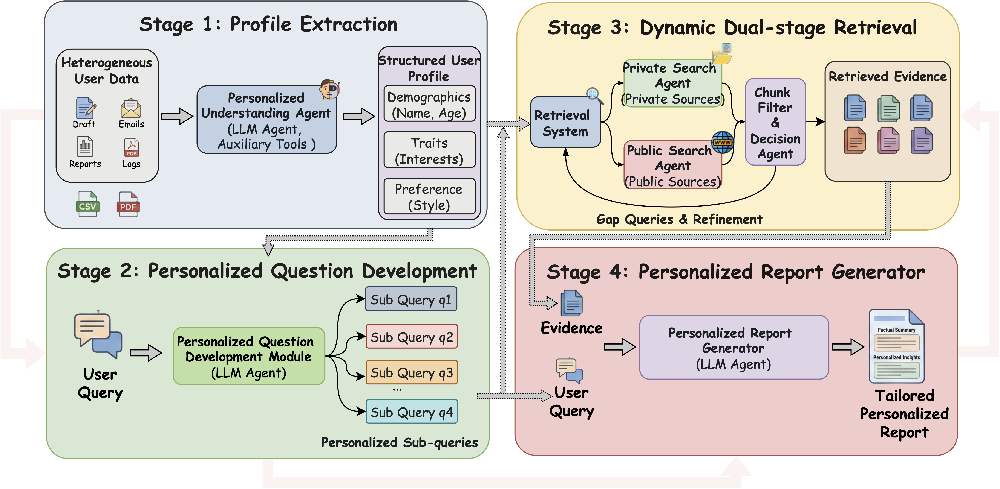
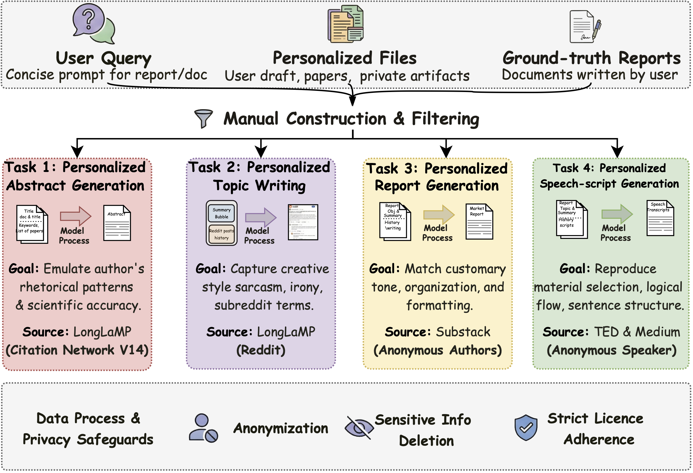
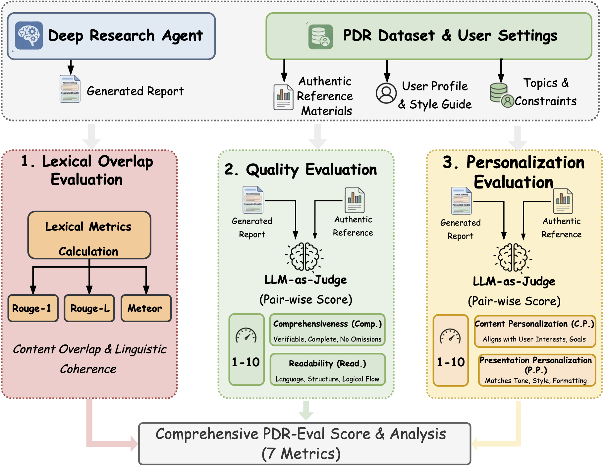

<h1 align="center">PDR — Personalized Deep Research</h1>

<p align="center">
  <strong>A User-Centric Framework, Dataset, and Hybrid Evaluation for Knowledge Discovery</strong>
</p>
<p align="center">
  <a href="https://github.com/Xiaopengli1/PDR">Paper</a> &nbsp;·&nbsp;
  <a href="https://drive.google.com/drive/folders/1VMFTtDw_OV4kRjuzppEK_7rGCB7IiP3N">Dataset</a> &nbsp;·&nbsp;
  <a href="#quickstart">Quickstart</a> &nbsp;·&nbsp;
  <a href="#evaluation">Evaluation</a> &nbsp;·&nbsp;
  <a href="#citation">Citation</a>
</p>


---

## Overview

**Personalized Deep Research (PDR)** integrates user-specific context into every stage of the deep research workflow—from planning and query formulation to iterative retrieval and report generation. Unlike generic "one-size-fits-all" systems, PDR produces outputs that align with each user's preferred style, structure, and topical focus.

This repository provides the official implementation of PDR, including:

- **Four core modules**: Profile Extraction, Personalized Question Development, Dynamic Dual-Stage Retrieval, and Personalized Report Generation
- **PDR Dataset**: The first benchmark for personalized deep research across four realistic task categories
- **PDR-Eval**: A hybrid evaluation framework combining lexical metrics with LLM-as-judge assessment for factuality and personalization

---

## Framework Architecture

<p align="center">
  
</p>

*Figure 1: Overview of the Personalized Deep Research (PDR) framework. The four core stages—profile extraction, personalized question development, dynamic dual-stage retrieval, and personalized report generation—seamlessly integrate user context throughout the pipeline.*

---

## Key Features

| Module | Description |
|--------|-------------|
| **Profile Extraction** | Transforms heterogeneous user data (drafts, emails, reports, logs) into structured profiles capturing demographics, traits, and preferences via an LLM-powered understanding agent. |
| **Personalized Question Development** | Decomposes user prompts into intent-aligned sub-queries, tailoring research sub-goals to individual profiles without manual intervention. |
| **Dynamic Dual-Stage Retrieval** | Unifies **private** (internal) and **public** (external) search; integrates chunk-filtering, a decision agent for adaptive stopping, and iterative query refinement. |
| **Personalized Report Generation** | Synthesizes retrieved evidence with profile signals to produce style-consistent, factually grounded reports. |
| **PDR-Eval** | Combines ROUGE-1, ROUGE-L, METEOR with LLM-as-judge scoring (Comprehensiveness, Readability, Content Personalization, Presentation Personalization). |

---

## Project Structure

```
PDR/
├── deepsearcher/              # Core PDR library
│   ├── agent/                 # RAG agents (DeepSearch, NaiveRAG)
│   ├── embedding/             # Embedding providers (FastEmbed, OpenAI, etc.)
│   ├── loader/                # File loaders & web crawlers
│   ├── llm/                   # LLM providers (DeepSeek, OpenAI, etc.)
│   ├── vector_db/             # Vector stores (Milvus, Qdrant)
│   ├── personalized_understanding.py
│   ├── online_query.py
│   └── offline_loading.py
├── data/                      # Dataset structure (see Datasets)
│   ├── abstract/
│   ├── report/
│   ├── speech/
│   └── topic/
├── examples/                  # Demo scripts
│   └── demo.py
├── evaluation/                # PDR-Eval (LLM-as-judge prompts & scripts)
├── local_retriever/           # Local retrieval server for public search
├── assets/                    # Figures and supplementary materials
├── config.yaml                # Configuration
└── requirements.txt
```

---

## Quickstart

### Installation

1. **Clone and install dependencies**

   ```bash
   git clone https://github.com/Xiaopengli1/PDR.git
   cd PDR
   pip install -r requirements.txt
   ```

2. **Install FastEmbed** for local embedding models:

   ```bash
   pip install fastembed
   ```

3. **Configure LLM and embedding** in `config.yaml` (e.g., DeepSeek API, OpenAI, or local models such as Qwen-3-14B).

### Usage

**Step 1: Launch the local retriever** (for public/external search)

```bash
bash local_retriever/retrieval_launch.sh
```

**Step 2: Run Deep Research**

```bash
python examples/demo.py
```

The script produces JSONL output with per-sample metrics (ROUGE, METEOR, F1) and generation results, suitable for downstream PDR-Eval assessment.

---

## Datasets

The **PDR Dataset** is designed for personalized deep research evaluation. Owing to its size, the dataset is hosted externally.

### Download

**Dataset download**: [PDR Dataset on Google Drive](https://drive.google.com/drive/folders/1VMFTtDw_OV4kRjuzppEK_7rGCB7IiP3N?usp=drive_link)

Download the folder and place the contents under `data/` to match the expected structure below.

### Dataset Overview

<p align="center">
  
</p>

*Figure 2: Dataset construction pipeline. Each task provides user queries, personalized files, and ground-truth reports written by the same user.*

| Task | Description | Source |
|------|-------------|--------|
| **Task 1: Abstract Generation** | Emulate author's rhetorical patterns while preserving scientific accuracy | LongLaMP (Citation Network V14) |
| **Task 2: Topic Writing** | Capture creative style, sarcasm, and subreddit-specific terminology | LongLaMP (Reddit TL;DR) |
| **Task 3: Report Generation** | Match tone, organization, and formatting conventions | Substack (anonymous authors) |
| **Task 4: Speech-Script Generation** | Reproduce material selection, logical flow, and sentence structure | TED & Medium |

### Per-Task Structure

Each author/task folder contains:

- `knowledge_base/` — Private user documents (drafts, papers, notes)
- `profile.txt` — Extracted profile material
- `input.txt` — Task prompt
- `output.txt` — Ground-truth report by the same user

---

## Evaluation

We provide **PDR-Eval**, a hybrid evaluation framework assessing both factual quality and personalization.

<p align="center">
  
</p>

*Figure 3: PDR-Eval combines lexical overlap (ROUGE, METEOR), quality evaluation (Comprehensiveness, Readability), and personalization evaluation (Content & Presentation Personalization).*

### Metrics

| Category | Metrics |
|----------|---------|
| **Lexical Overlap** | ROUGE-1, ROUGE-L, METEOR |
| **Quality (LLM-as-Judge)** | Comprehensiveness (Comp.), Readability (Read.) |
| **Personalization (LLM-as-Judge)** | Content Personalization (C.P.), Presentation Personalization (P.P.) |

### Running Evaluation

```bash
cd evaluation
# Use script.py with your JSONL output from examples/demo.py
python script.py
```

Evaluation prompts are provided in `evaluation/evaluation_prompt.py`.

---

## Citation

If you find PDR useful, please cite our paper:

```bibtex

```

---

## License

This project is released under the license specified in [LICENSE.txt](LICENSE.txt).

---

## Acknowledgments

PDR builds upon [deep-searcher](https://github.com/zilliztech/deep-searcher) for retrieval infrastructure. We thank the open-source community and our collaborators at City University of Hong Kong and Huawei Noah's Ark Lab.
